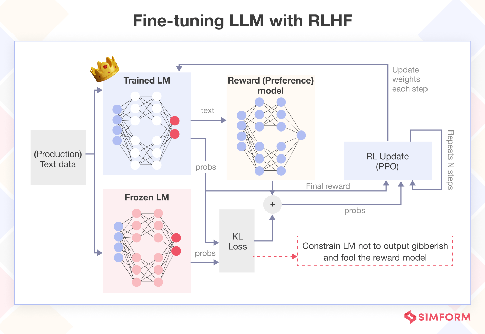

## ReinforcementLearning-VLMs

<b>Vision Language Model</b>
In this repo, we study about Vision Language Models (VLMs) and Reinforcement Learning with Human Feedback.

The model is built based on nanoVLM and VLM-from-Scratch folder, and rewrite in vlm.ipynb. 

We have wraped it in Dockerfile and docker-compose file to train the base model. The model is trained on the and show good performance in chosen question.

<b>Reinforcement Learning:</b>

We have implemented all steps in RLHF flow in PPOTrainer_scratch.ipynb file. 

